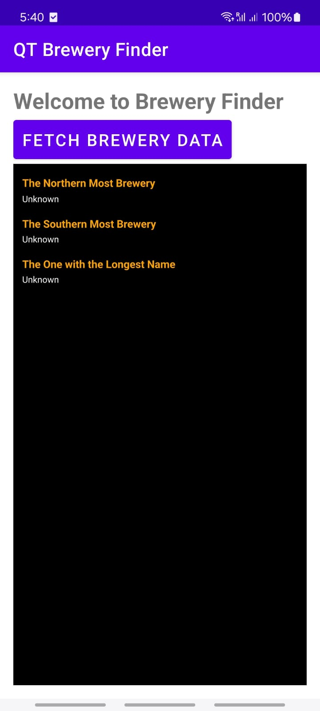
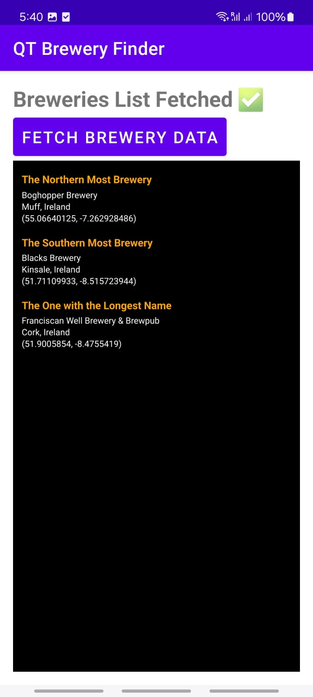

# 📌 Brewery Finder App (Kotlin + QML Integration)

## 📖 Overview
This project is a **Qt Quick for Android application** that fetches and displays **brewery information from Ireland**.  
The app identifies the following:
- 📍 **The northernmost brewery**
- 📍 **The southernmost brewery**
- 📍 **The brewery with the longest name**

🚀 **Tech Stack:**
- **Backend:** Kotlin (Handles API fetching & logic)
- **Frontend:** Hybrid UI (Android XML for some UI + QML for dynamic UI)
- **Tools & Frameworks:** Qt 6.8, Android Studio, CMake, Gradle, Retrofit (for API)

---

## 📌 Background Information
Qt Quick (QML) is **mostly used with C++**, making Kotlin integration rare.  
🔍 When searching online, I found almost no resources explaining how to **connect Kotlin with QML**.  
This project focuses on:
- **Exploring Kotlin-QML interaction** for Android apps.
- **Bridging communication between Kotlin and QML.**
- **Fetching real-time brewery data using APIs instead of local databases.**

## 📌 Creation Process

### **1️⃣ Setting Up the Environment**
- Installed **Qt 6.8**, **Qt for Android Studio Plugin**  
- Configured **Android SDK, NDK, Clang Compiler, and CMake**  
- Set up **Gradle and Qt dependencies** for smooth integration

### **2️⃣ Structuring the Project**
- Created a **Kotlin-based Android project**  
- Added new QT project  
- Modify your`build.gradle.kts` **(Project-level)** and add:

gradle
```
QtBuild {
    qtPath = file("/home/lawunn/Qt/6.8.2")  // Path to Qt installation
    projectPath = file("/home/lawunn/qttest/qtquick_brewery/breweryfinder") // Path to the Qt project
} 
```
- Without this, Gradle will not recognize Qt components and will fail to build the project.
- If Qt-related references (like QtQuickView or QtQmlStatus) show "Unresolved Reference" errors, double-check that the QtBuild block is correctly configured.
- Configured **Qt Gradle plugin** for compiling QML modules

### **3️⃣ Implementing Features**
#### **🔹 Backend (Kotlin)**
✔ Used **Retrofit + Gson** to fetch brewery data from an API  
✔ Implemented logic to find the **northernmost, southernmost, and longest-name brewery**  
✔ Established **communication bridge between Kotlin and QML**

#### **🔹 Frontend (UI in XML + QML)**
✔ Used **XML layouts** for **Android-native UI elements** (buttons, text)  
✔ Integrated **QML inside Kotlin using `QtQuickView`** for a dynamic UI

---

## 📌 **Struggles & Learning Experience**

### **💥 Challenges Faced**
**1. Connecting QML and Kotlin**
- No clear tutorials on **QtQuickView with Kotlin** (only C++ examples exist).
- Had to experiment with **QtQuickView, QML modules, and JNI communication**.
- Faced many **missing dependencies and Gradle errors**.

**2. Setting Up the Build System**
- CMake path conflicts → **"Source directory mismatch" errors**
- Qt dependencies not found → **`Qt6Config.cmake` missing issue**
- **NDK, Clang, and C++ errors**, even though the main logic is in Kotlin

**3. Gradle & Dependency Conflicts**
- Initial errors with `QtQuickView` and missing `org.qtproject` packages
- Had to manually add the **correct Gradle version for Qt compatibility**  

## 📌 My Own points

Initially, I thought this would be a simple Kotlin project, but as I started working, I realized that **finding resources for integrating Kotlin and QML together was almost impossible**. Most Qt Quick applications are built using **C++ as the backend**, so trying to do this in Kotlin felt like uncharted territory. I searched on Google, YouTube, and even Qt’s official documentation, but there were **no complete tutorials or guides on how to make this work**.

One of my biggest struggles was **making the Kotlin backend interact with QML**. Unlike C++, where the connection process is well-documented, Kotlin requires extra steps that are not clearly explained anywhere. I had to manually experiment with `QtQuickView`, understand how QML modules are loaded, and deal with Gradle configurations that kept failing. Debugging was especially frustrating because the errors I encountered were **not common** and I had to solve them mostly through trial and error.

Another challenge was configuring **CMake and Gradle** correctly. I ran into multiple issues, like **"Source directory mismatch" errors**, **"Qt6Config.cmake not found"**, and **Android NDK-related errors**. These issues made the build process fail, and I had to carefully fix each one step by step, making sure that the Qt paths were set correctly.

Despite all the struggles, I finally managed to make Kotlin and QML work together, and it was a huge learning experience. I now have a much deeper understanding of **how Qt interacts with Android, how to debug complex build issues, and how QML can be used in a non-C++ environment**. This project was challenging, but overcoming these issues was rewarding.

## 📌 Map Feature Attempt & Issues Faced

I attempted to add a map feature using Qt Location and Qt Positioning, but I encountered several issues. It seems that some installations on Arch Linux might be missing dependencies required for proper map rendering. Since Qt Location and Positioning were installed correctly, the integration process should have been straightforward. However, the app failed to display the map properly, and I suspect the issue is related to missing Qt libraries or system dependencies.

If Qt Location and Positioning are fully installed and configured, adding a map should be easy. But for now, due to these system-related errors, I decided to prioritize completing the API functionality first before troubleshooting the map further.

## Visuals
Here are some screenshots of the app:

| Home Screen                        | Catching Screen                            | Successful Fetch Screen                  |
|------------------------------------|--------------------------------------------|------------------------------------------|
|  |  |  |
